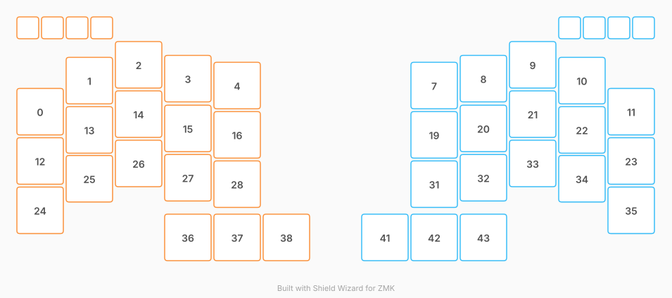

# ZMK Configuration for StudioMax

*Generated by Shield Wizard for ZMK*



Download compiled firmware from the Actions tab. <https://zmk.dev/docs/user-setup#installing-the-firmware>

Edit your keymap <https://zmk.dev/docs/keymaps>.
User keymap is located at [`config/studiomax.keymap`](config/studiomax.keymap).

-----

<details>
<summary>
Shield Wizard Debug Information
</summary>

In case of broken configuration, here is the Shield Wizard internal data used to generate this configuration:

Commit: 7ee29dba13bb6e3b8a7524c1aa57934684b06785

```json
{"name":"StudioMax","shield":"studiomax","dongle":false,"modules":[],"layout":[{"id":"01KY3BJAKFA9G7VQDY8E1KCGJV","part":0,"row":0,"col":-1,"w":1,"h":1,"x":0,"y":0.95,"r":0,"rx":0,"ry":0},{"id":"01KY3BJAKFQJS4R4DT5PHYAXA0","part":0,"row":0,"col":0,"w":1,"h":1,"x":1,"y":0.32,"r":0,"rx":0,"ry":0},{"id":"01KY3BJAKFY5YSKZETKHGMYF5S","part":0,"row":0,"col":1,"w":1,"h":1,"x":2,"y":0,"r":0,"rx":0,"ry":0},{"id":"01KY3BJAKF01MXGBMS4DCWG6K1","part":0,"row":0,"col":2,"w":1,"h":1,"x":3,"y":0.28,"r":0,"rx":0,"ry":0},{"id":"01KY3BJAKFMRFVWX81Q9CRH8QY","part":0,"row":0,"col":3,"w":1,"h":1,"x":4,"y":0.42,"r":0,"rx":0,"ry":0},{"id":"01KY3BX3JEQJYHZ762MV7Y2J8Z","part":0,"row":0,"col":4,"w":0.5,"h":0.5,"x":0,"y":-0.5,"r":0,"rx":0,"ry":0},{"id":"01KY3BXD0AFE5PTG926ZXVJR9D","part":1,"row":0,"col":5,"w":0.5,"h":0.5,"x":11,"y":-0.5,"r":0,"rx":0,"ry":0},{"id":"01KY3BJAKFHE8X2K4GX721366M","part":1,"row":0,"col":6,"w":1,"h":1,"x":8,"y":0.42,"r":0,"rx":0,"ry":0},{"id":"01KY3BJAKFXXCDV1HXS916VQ75","part":1,"row":0,"col":7,"w":1,"h":1,"x":9,"y":0.28,"r":0,"rx":0,"ry":0},{"id":"01KY3BJAKFPY89M0NYR35T4FBT","part":1,"row":0,"col":8,"w":1,"h":1,"x":10,"y":0,"r":0,"rx":0,"ry":0},{"id":"01KY3BJAKF6TZMHYBWFER7WCVS","part":1,"row":0,"col":9,"w":1,"h":1,"x":11,"y":0.32,"r":0,"rx":0,"ry":0},{"id":"01KY3BJAKFGGRVAMDXW9BM2RN5","part":1,"row":0,"col":10,"w":1,"h":1,"x":12,"y":0.95,"r":0,"rx":0,"ry":0},{"id":"01KY3BJAKF5R9QDRNW3V49NN4E","part":0,"row":1,"col":-1,"w":1,"h":1,"x":0,"y":1.95,"r":0,"rx":0,"ry":0},{"id":"01KY3BJAKFVJT4Q6BE3E6BVHW5","part":0,"row":1,"col":0,"w":1,"h":1,"x":1,"y":1.32,"r":0,"rx":0,"ry":0},{"id":"01KY3BJAKF31ZVMVXA9YWSFCV1","part":0,"row":1,"col":1,"w":1,"h":1,"x":2,"y":1,"r":0,"rx":0,"ry":0},{"id":"01KY3BJAKF3XKD0C22P6K45QH2","part":0,"row":1,"col":2,"w":1,"h":1,"x":3,"y":1.29,"r":0,"rx":0,"ry":0},{"id":"01KY3BJAKF24FCC22J8MWSMJV0","part":0,"row":1,"col":3,"w":1,"h":1,"x":4,"y":1.42,"r":0,"rx":0,"ry":0},{"id":"01KY3BXC5KYE09A0R4PQA4M2HG","part":0,"row":1,"col":4,"w":0.5,"h":0.5,"x":0.5,"y":-0.5,"r":0,"rx":0,"ry":0},{"id":"01KY3BXD5Y7T2GFDXQ72BZPSZM","part":1,"row":1,"col":5,"w":0.5,"h":0.5,"x":11.5,"y":-0.5,"r":0,"rx":0,"ry":0},{"id":"01KY3BJAKFQB1DGN62WWP0M3SS","part":1,"row":1,"col":6,"w":1,"h":1,"x":8,"y":1.42,"r":0,"rx":0,"ry":0},{"id":"01KY3BJAKFFXGRS1BFY86BY2WT","part":1,"row":1,"col":7,"w":1,"h":1,"x":9,"y":1.29,"r":0,"rx":0,"ry":0},{"id":"01KY3BJAKF9FTDA7E7D6SHN7J9","part":1,"row":1,"col":8,"w":1,"h":1,"x":10,"y":1,"r":0,"rx":0,"ry":0},{"id":"01KY3BJAKFHA495Z24PMNQ2Y0G","part":1,"row":1,"col":9,"w":1,"h":1,"x":11,"y":1.32,"r":0,"rx":0,"ry":0},{"id":"01KY3BJAKF9BX611WN4BEW8591","part":1,"row":1,"col":10,"w":1,"h":1,"x":12,"y":1.95,"r":0,"rx":0,"ry":0},{"id":"01KY3BJAKF4C62SS50VKBVZXXZ","part":0,"row":2,"col":-1,"w":1,"h":1,"x":0,"y":2.95,"r":0,"rx":0,"ry":0},{"id":"01KY3BJAKFY5KW4H9NT7MFZT5S","part":0,"row":2,"col":0,"w":1,"h":1,"x":1,"y":2.31,"r":0,"rx":0,"ry":0},{"id":"01KY3BJAKFS8QZ9RGQSKDTPTWT","part":0,"row":2,"col":1,"w":1,"h":1,"x":2,"y":2,"r":0,"rx":0,"ry":0},{"id":"01KY3BJAKF4FSQM13SEXQSG5WT","part":0,"row":2,"col":2,"w":1,"h":1,"x":3,"y":2.29,"r":0,"rx":0,"ry":0},{"id":"01KY3BJAKFV23Z6MJZG5EGJ8AW","part":0,"row":2,"col":3,"w":1,"h":1,"x":4,"y":2.42,"r":0,"rx":0,"ry":0},{"id":"01KY3BXCE1MHE58A26M8QQDSMF","part":0,"row":2,"col":4,"w":0.5,"h":0.5,"x":1,"y":-0.5,"r":0,"rx":0,"ry":0},{"id":"01KY3BXDECWFY1MF0D9AVARJXD","part":1,"row":2,"col":5,"w":0.5,"h":0.5,"x":12,"y":-0.5,"r":0,"rx":0,"ry":0},{"id":"01KY3BJAKFW8V2KCN7T7XP0PYQ","part":1,"row":2,"col":6,"w":1,"h":1,"x":8,"y":2.42,"r":0,"rx":0,"ry":0},{"id":"01KY3BJAKF5P35C59QH29G9330","part":1,"row":2,"col":7,"w":1,"h":1,"x":9,"y":2.29,"r":0,"rx":0,"ry":0},{"id":"01KY3BJAKFDJMEX7A8XQQBFZ5Z","part":1,"row":2,"col":8,"w":1,"h":1,"x":10,"y":2,"r":0,"rx":0,"ry":0},{"id":"01KY3BJAKFZNQH3RA0PJNSJYMK","part":1,"row":2,"col":9,"w":1,"h":1,"x":11,"y":2.31,"r":0,"rx":0,"ry":0},{"id":"01KY3BJAKFJ7APD7Y6X0CHWAJD","part":1,"row":2,"col":10,"w":1,"h":1,"x":12,"y":2.95,"r":0,"rx":0,"ry":0},{"id":"01KY3C3JJKKTV5CFAN5SAWYY1V","part":0,"row":3,"col":1,"w":1,"h":1,"x":3,"y":3.5,"r":0,"rx":0,"ry":0},{"id":"01KY3BJAKF0SAK1CK80W3TRSP1","part":0,"row":3,"col":2,"w":1,"h":1,"x":4,"y":3.5,"r":0,"rx":4.3,"ry":4.55},{"id":"01KY3BJAKFF7DPHNY52P5TK6ME","part":0,"row":3,"col":3,"w":1,"h":1,"x":5,"y":3.5,"r":0,"rx":4.3,"ry":4.55},{"id":"01KY3BXDM00V8WMXKYCGB5MGWV","part":0,"row":3,"col":4,"w":0.5,"h":0.5,"x":1.5,"y":-0.5,"r":0,"rx":0,"ry":0},{"id":"01KY3BXDS5APJ9J6RNDHCGP5JY","part":1,"row":3,"col":5,"w":0.5,"h":0.5,"x":12.5,"y":-0.5,"r":0,"rx":0,"ry":0},{"id":"01KY3BJAKFKMZS4YCVC6T34KNM","part":1,"row":3,"col":6,"w":1,"h":1,"x":7,"y":3.5,"r":0,"rx":7.7,"ry":4.55},{"id":"01KY3BJAKFXGN0TH0286NMR0DN","part":1,"row":3,"col":7,"w":1,"h":1,"x":8,"y":3.5,"r":0,"rx":7.7,"ry":4.55},{"id":"01KY3C3JSMJ4CV4E5G7NAYB6S0","part":1,"row":3,"col":8,"w":1,"h":1,"x":9,"y":3.5,"r":0,"rx":0,"ry":0}],"parts":[{"name":"left","controller":"xiao_ble_plus","pins":{"d17":{"usage":"bus","bus":"spi0","role":"sck"},"d19":{"usage":"bus","bus":"spi0","role":"mosi"},"d18":{"usage":"device","deviceId":"01KY3CENNF50NJMR29WHNJZZ6E","role":"cs"},"d0":{"usage":"encoder","encoderId":"01KY3DGYSHBKMFBFQW346RJGVJ","role":"pinA"},"d1":{"usage":"encoder","encoderId":"01KY3DGYSHBKMFBFQW346RJGVJ","role":"pinB"},"d6":{"usage":"encoder","encoderId":"01KY3DH4F5ZXZXT11N9Y4DNQS6","role":"pinA"},"d7":{"usage":"encoder","encoderId":"01KY3DH4F5ZXZXT11N9Y4DNQS6","role":"pinB"},"d11":{"usage":"encoder","encoderId":"01KY3DHHBXRC60ZR4X8J8CVP2G","role":"pinA"},"d12":{"usage":"encoder","encoderId":"01KY3DHHBXRC60ZR4X8J8CVP2G","role":"pinB"},"d14":{"usage":"encoder","encoderId":"01KY3DJ1YRK2XN1Q7425WXRZW0","role":"pinA"},"d15":{"usage":"encoder","encoderId":"01KY3DJ1YRK2XN1Q7425WXRZW0","role":"pinB"},"d8":{"usage":"bus","bus":"spi2","role":"sck"},"d10":{"usage":"bus","bus":"spi2","role":"mosi"},"d9":{"usage":"device","deviceId":"01KY3DX931QJTDV7QYQREDPME8","role":"cs"},"d13":{"usage":"bus","bus":"spi3","role":"mosi"},"d2":{"usage":"kscan","kscan":"01KY3E74YBQ64RGSQZMS9XAC7Z","role":"input"},"d3":{"usage":"kscan","kscan":"01KY3E74YBQ64RGSQZMS9XAC7Z","role":"input"},"d4":{"usage":"kscan","kscan":"01KY3E74YBQ64RGSQZMS9XAC7Z","role":"input"},"d5":{"usage":"kscan","kscan":"01KY3E74YBQ64RGSQZMS9XAC7Z","role":"input"},"01KY3CENNF50NJMR29WHNJZZ6E:1":{"usage":"kscan","kscan":"01KY3E74YBQ64RGSQZMS9XAC7Z","role":"output"},"01KY3CENNF50NJMR29WHNJZZ6E:2":{"usage":"kscan","kscan":"01KY3E74YBQ64RGSQZMS9XAC7Z","role":"output"},"01KY3CENNF50NJMR29WHNJZZ6E:3":{"usage":"kscan","kscan":"01KY3E74YBQ64RGSQZMS9XAC7Z","role":"output"},"01KY3CENNF50NJMR29WHNJZZ6E:4":{"usage":"kscan","kscan":"01KY3E74YBQ64RGSQZMS9XAC7Z","role":"output"},"01KY3CENNF50NJMR29WHNJZZ6E:5":{"usage":"kscan","kscan":"01KY3E74YBQ64RGSQZMS9XAC7Z","role":"output"},"01KY3CENNF50NJMR29WHNJZZ6E:6":{"usage":"kscan","kscan":"01KY3E74YBQ64RGSQZMS9XAC7Z","role":"output"}},"kscans":[{"kind":"matrix","id":"01KY3E74YBQ64RGSQZMS9XAC7Z","diodes":true}],"keys":{"01KY3BJAKFA9G7VQDY8E1KCGJV":{"input":"d2","output":"01KY3CENNF50NJMR29WHNJZZ6E:1"},"01KY3BJAKF5R9QDRNW3V49NN4E":{"input":"d3","output":"01KY3CENNF50NJMR29WHNJZZ6E:1"},"01KY3BJAKF4C62SS50VKBVZXXZ":{"input":"d4","output":"01KY3CENNF50NJMR29WHNJZZ6E:1"},"01KY3BJAKFQJS4R4DT5PHYAXA0":{"input":"d2","output":"01KY3CENNF50NJMR29WHNJZZ6E:2"},"01KY3BJAKFVJT4Q6BE3E6BVHW5":{"input":"d3","output":"01KY3CENNF50NJMR29WHNJZZ6E:2"},"01KY3BJAKFY5KW4H9NT7MFZT5S":{"input":"d4","output":"01KY3CENNF50NJMR29WHNJZZ6E:2"},"01KY3BJAKFY5YSKZETKHGMYF5S":{"input":"d2","output":"01KY3CENNF50NJMR29WHNJZZ6E:3"},"01KY3BJAKF31ZVMVXA9YWSFCV1":{"input":"d3","output":"01KY3CENNF50NJMR29WHNJZZ6E:3"},"01KY3BJAKFS8QZ9RGQSKDTPTWT":{"input":"d4","output":"01KY3CENNF50NJMR29WHNJZZ6E:3"},"01KY3C3JJKKTV5CFAN5SAWYY1V":{"input":"d5","output":"01KY3CENNF50NJMR29WHNJZZ6E:3"},"01KY3BJAKF01MXGBMS4DCWG6K1":{"input":"d2","output":"01KY3CENNF50NJMR29WHNJZZ6E:4"},"01KY3BJAKF3XKD0C22P6K45QH2":{"input":"d3","output":"01KY3CENNF50NJMR29WHNJZZ6E:4"},"01KY3BJAKF4FSQM13SEXQSG5WT":{"input":"d4","output":"01KY3CENNF50NJMR29WHNJZZ6E:4"},"01KY3BJAKF0SAK1CK80W3TRSP1":{"input":"d5","output":"01KY3CENNF50NJMR29WHNJZZ6E:4"},"01KY3BJAKFMRFVWX81Q9CRH8QY":{"input":"d2","output":"01KY3CENNF50NJMR29WHNJZZ6E:5"},"01KY3BJAKF24FCC22J8MWSMJV0":{"input":"d3","output":"01KY3CENNF50NJMR29WHNJZZ6E:5"},"01KY3BJAKFV23Z6MJZG5EGJ8AW":{"input":"d4","output":"01KY3CENNF50NJMR29WHNJZZ6E:5"},"01KY3BJAKFF7DPHNY52P5TK6ME":{"input":"d5","output":"01KY3CENNF50NJMR29WHNJZZ6E:5"},"01KY3BX3JEQJYHZ762MV7Y2J8Z":{"input":"d2","output":"01KY3CENNF50NJMR29WHNJZZ6E:6"},"01KY3BXC5KYE09A0R4PQA4M2HG":{"input":"d3","output":"01KY3CENNF50NJMR29WHNJZZ6E:6"},"01KY3BXCE1MHE58A26M8QQDSMF":{"input":"d4","output":"01KY3CENNF50NJMR29WHNJZZ6E:6"},"01KY3BXDM00V8WMXKYCGB5MGWV":{"input":"d5","output":"01KY3CENNF50NJMR29WHNJZZ6E:6"}},"encoders":[{"id":"01KY3DGYSHBKMFBFQW346RJGVJ"},{"id":"01KY3DH4F5ZXZXT11N9Y4DNQS6"},{"id":"01KY3DHHBXRC60ZR4X8J8CVP2G"},{"id":"01KY3DJ1YRK2XN1Q7425WXRZW0"}],"buses":{"spi0":{"type":"spi","devices":[{"id":"01KY3CENNF50NJMR29WHNJZZ6E","type":"74hc595","ngpios":8}]},"spi2":{"type":"spi","devices":[{"id":"01KY3DX931QJTDV7QYQREDPME8","type":"niceview"}]},"spi3":{"type":"spi","devices":[{"id":"01KY3DY6CRKKKAQ7BAWH8TCA7J","type":"ws2812","len":19}]}}},{"name":"right","controller":"xiao_ble_plus","pins":{"d17":{"usage":"bus","bus":"spi0","role":"sck"},"d19":{"usage":"bus","bus":"spi0","role":"mosi"},"d18":{"usage":"device","deviceId":"01KY3ED3QVGJ754C1311YZ0XHB","role":"cs"},"d2":{"usage":"kscan","kscan":"01KY3EGVW4F5STPZWXMTMS64HD","role":"input"},"d3":{"usage":"kscan","kscan":"01KY3EGVW4F5STPZWXMTMS64HD","role":"input"},"d4":{"usage":"kscan","kscan":"01KY3EGVW4F5STPZWXMTMS64HD","role":"input"},"d5":{"usage":"kscan","kscan":"01KY3EGVW4F5STPZWXMTMS64HD","role":"input"},"01KY3ED3QVGJ754C1311YZ0XHB:1":{"usage":"kscan","kscan":"01KY3EGVW4F5STPZWXMTMS64HD","role":"output"},"01KY3ED3QVGJ754C1311YZ0XHB:2":{"usage":"kscan","kscan":"01KY3EGVW4F5STPZWXMTMS64HD","role":"output"},"01KY3ED3QVGJ754C1311YZ0XHB:3":{"usage":"kscan","kscan":"01KY3EGVW4F5STPZWXMTMS64HD","role":"output"},"01KY3ED3QVGJ754C1311YZ0XHB:4":{"usage":"kscan","kscan":"01KY3EGVW4F5STPZWXMTMS64HD","role":"output"},"01KY3ED3QVGJ754C1311YZ0XHB:5":{"usage":"kscan","kscan":"01KY3EGVW4F5STPZWXMTMS64HD","role":"output"},"01KY3ED3QVGJ754C1311YZ0XHB:6":{"usage":"kscan","kscan":"01KY3EGVW4F5STPZWXMTMS64HD","role":"output"},"d13":{"usage":"bus","bus":"spi3","role":"mosi"},"d8":{"usage":"bus","bus":"spi2","role":"sck"},"d10":{"usage":"bus","bus":"spi2","role":"mosi"},"d9":{"usage":"device","deviceId":"01KY3EKC7Y4TVQ9KY6N3CV1FSF","role":"cs"},"d0":{"usage":"encoder","encoderId":"01KY3EM6B1GBB6Y2DMDNX4H0XZ","role":"pinA"},"d1":{"usage":"encoder","encoderId":"01KY3EM6B1GBB6Y2DMDNX4H0XZ","role":"pinB"},"d6":{"usage":"encoder","encoderId":"01KY3EMA5CCPRYBVMG8NTSQXT0","role":"pinA"},"d7":{"usage":"encoder","encoderId":"01KY3EMA5CCPRYBVMG8NTSQXT0","role":"pinB"},"d11":{"usage":"encoder","encoderId":"01KY3EME7FTDYS1SYRR82SRXGN","role":"pinA"},"d12":{"usage":"encoder","encoderId":"01KY3EME7FTDYS1SYRR82SRXGN","role":"pinB"},"d14":{"usage":"encoder","encoderId":"01KY3EMMVJ8BF8VZXR9QX9C5QT","role":"pinA"},"d15":{"usage":"encoder","encoderId":"01KY3EMMVJ8BF8VZXR9QX9C5QT","role":"pinB"}},"kscans":[{"kind":"matrix","id":"01KY3EGVW4F5STPZWXMTMS64HD","diodes":true}],"keys":{"01KY3BXD0AFE5PTG926ZXVJR9D":{"input":"d2","output":"01KY3ED3QVGJ754C1311YZ0XHB:6"},"01KY3BJAKFHE8X2K4GX721366M":{"input":"d2","output":"01KY3ED3QVGJ754C1311YZ0XHB:5"},"01KY3BJAKFXXCDV1HXS916VQ75":{"input":"d2","output":"01KY3ED3QVGJ754C1311YZ0XHB:4"},"01KY3BJAKFPY89M0NYR35T4FBT":{"input":"d2","output":"01KY3ED3QVGJ754C1311YZ0XHB:3"},"01KY3BJAKF6TZMHYBWFER7WCVS":{"input":"d2","output":"01KY3ED3QVGJ754C1311YZ0XHB:2"},"01KY3BJAKFGGRVAMDXW9BM2RN5":{"input":"d2","output":"01KY3ED3QVGJ754C1311YZ0XHB:1"},"01KY3BXD5Y7T2GFDXQ72BZPSZM":{"input":"d3","output":"01KY3ED3QVGJ754C1311YZ0XHB:6"},"01KY3BJAKFQB1DGN62WWP0M3SS":{"input":"d3","output":"01KY3ED3QVGJ754C1311YZ0XHB:5"},"01KY3BJAKFFXGRS1BFY86BY2WT":{"input":"d3","output":"01KY3ED3QVGJ754C1311YZ0XHB:4"},"01KY3BJAKF9FTDA7E7D6SHN7J9":{"input":"d3","output":"01KY3ED3QVGJ754C1311YZ0XHB:3"},"01KY3BJAKFHA495Z24PMNQ2Y0G":{"input":"d3","output":"01KY3ED3QVGJ754C1311YZ0XHB:2"},"01KY3BJAKF9BX611WN4BEW8591":{"input":"d3","output":"01KY3ED3QVGJ754C1311YZ0XHB:1"},"01KY3BXDECWFY1MF0D9AVARJXD":{"input":"d4","output":"01KY3ED3QVGJ754C1311YZ0XHB:6"},"01KY3BJAKFW8V2KCN7T7XP0PYQ":{"input":"d4","output":"01KY3ED3QVGJ754C1311YZ0XHB:5"},"01KY3BJAKF5P35C59QH29G9330":{"input":"d4","output":"01KY3ED3QVGJ754C1311YZ0XHB:4"},"01KY3BJAKFDJMEX7A8XQQBFZ5Z":{"input":"d4","output":"01KY3ED3QVGJ754C1311YZ0XHB:3"},"01KY3BJAKFZNQH3RA0PJNSJYMK":{"input":"d4","output":"01KY3ED3QVGJ754C1311YZ0XHB:2"},"01KY3BJAKFJ7APD7Y6X0CHWAJD":{"input":"d4","output":"01KY3ED3QVGJ754C1311YZ0XHB:1"},"01KY3BXDS5APJ9J6RNDHCGP5JY":{"input":"d5","output":"01KY3ED3QVGJ754C1311YZ0XHB:6"},"01KY3BJAKFKMZS4YCVC6T34KNM":{"input":"d5","output":"01KY3ED3QVGJ754C1311YZ0XHB:5"},"01KY3BJAKFXGN0TH0286NMR0DN":{"input":"d5","output":"01KY3ED3QVGJ754C1311YZ0XHB:4"},"01KY3C3JSMJ4CV4E5G7NAYB6S0":{"input":"d5","output":"01KY3ED3QVGJ754C1311YZ0XHB:3"}},"encoders":[{"id":"01KY3EM6B1GBB6Y2DMDNX4H0XZ"},{"id":"01KY3EMA5CCPRYBVMG8NTSQXT0"},{"id":"01KY3EME7FTDYS1SYRR82SRXGN"},{"id":"01KY3EMMVJ8BF8VZXR9QX9C5QT"}],"buses":{"spi0":{"type":"spi","devices":[{"id":"01KY3ED3QVGJ754C1311YZ0XHB","type":"74hc595","ngpios":8}]},"spi3":{"type":"spi","devices":[{"id":"01KY3EJXF6YVFKFX0WJG9V5F12","type":"ws2812","len":19}]},"spi2":{"type":"spi","devices":[{"id":"01KY3EKC7Y4TVQ9KY6N3CV1FSF","type":"niceview"}]}}}]}
```

</details>
